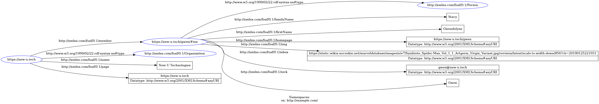
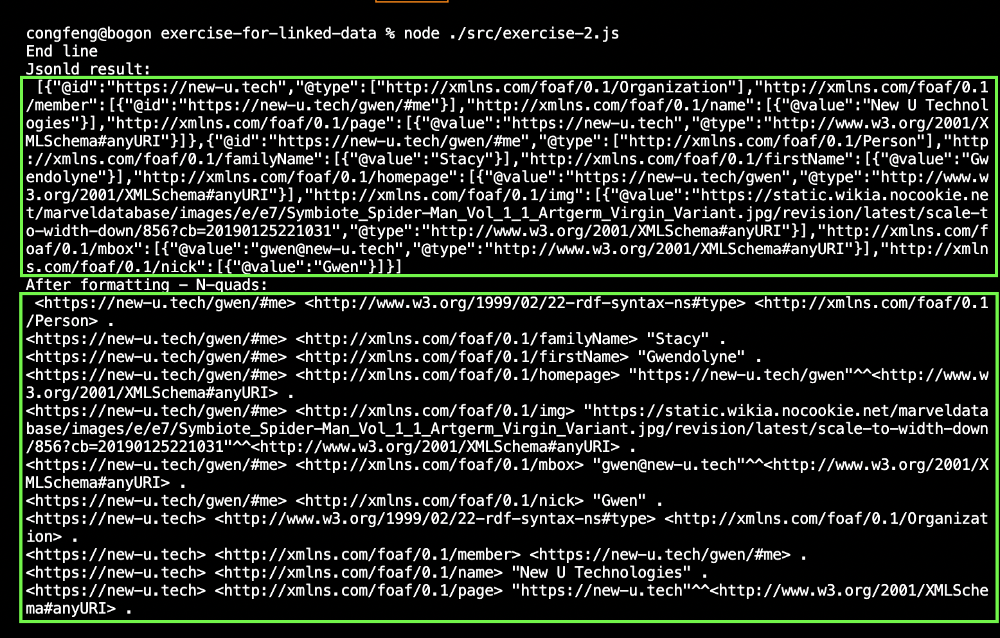

# Exercises for Linked Data

## exercise-1:

> Create a JSON-LD representation of the person data below using the FOAF Vocabulary.
> Tip: you can use https://json-ld.org/playground/ to validate and inspect your JSON-LD.
> #### Person data
> You find information about a person below.
> * Unique id: https://new-u.tech/gwen/#me
> * First name: Gwendolyne
> * Last name: Stacy
> * Nickname: Gwen
> * Personal website: https://new-u.tech/gwen
> * Email: gwen@new-u.tech
> * Profile picture: image
> * Member of this organization
> * Name: New U Technologies
> * Website: https://new-u.tech

File: [exercise-1.js](./src/exercise-1.js)  
The result for exercise-1:

JsonLD model for exercise-1:

## exercise-2:
>Parse your solution of exercise 1.1 in JavaScript using the library jsonld.js and
> * Print an RDF representation of the JSON-LD data.
> * Extract organization information using a frame.

File: [exercise-2.js](./src/exercise-2.js)  
The result for exercise-2:

Extract organization information with type frame 
>frame={'@type': 'http://xmlns.com/foaf/0.1/Organization',} 

The result for organization information:

## Edition-2:

File: [edition-2.js](./src/edition-2.js)    
Save jsonld data as a [jsonldData.txt](./data/jsonldData.txt) file. 

Extract organization information with id 
>frame_id={'@id': 'https://new-u.tech',}

Extract organization information with mbox
>frame_mbox={'@mbox': {'@value': 'gwen@new-u.tech'}}

## Thank you